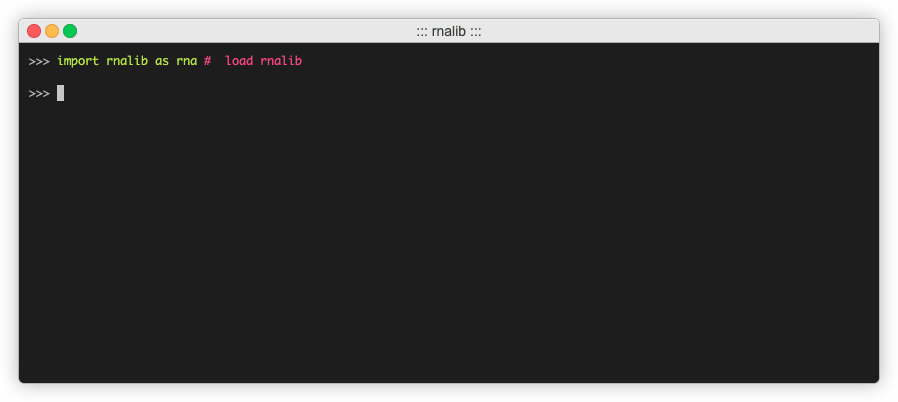

# rnalib: a Python-based transcriptomics library

Rnalib is a python library for handling transcriptomics data.

## Installation

To install the latest version of rnalib, use the following command:

```bash
pip install rnalib
```

## Quickstart


Please see the [rnalib's documentation](https://rnalib.readthedocs.io/en/latest/) for more information.

[](https://rnalib.readthedocs.io/en/latest/).

## Tutorials

We also provide a set of tutorials for further demonstrating *rnalib*'s API:
* [Tutorial: Read mismatch analysis](notebooks/Tutorial_mismatch_analysis.ipynb)
* [Tutorial: Comparison of gene annotation sets](notebooks/Tutorial_compare_annotation_sets.ipynb)
* [Tutorial: shRNA analysis](notebooks/Tutorial_shRNA_analysis.ipynb)
* [Tutorial: Transcriptome analysis](notebooks/Tutorial_transcriptome_annotation.ipynb)

We also showcase how the combination of (the strengths of) multiple genomics libraries leads to an overall benefit in multiple tutorials:
* [Tutorial: CTCF analysis with rnalib and bioframe](notebooks/Tutorial_CTCF_analysis.ipynb)
* [Tutorial: Expression analysis with rnalib and genemunge](notebooks/Tutorial_expression_analysis.ipynb)
* We also compare *rnalib* to other genomics libraries wrt. performance in this [RelatedWork](notebooks/RelatedWork_performance.ipynb) notebook.
